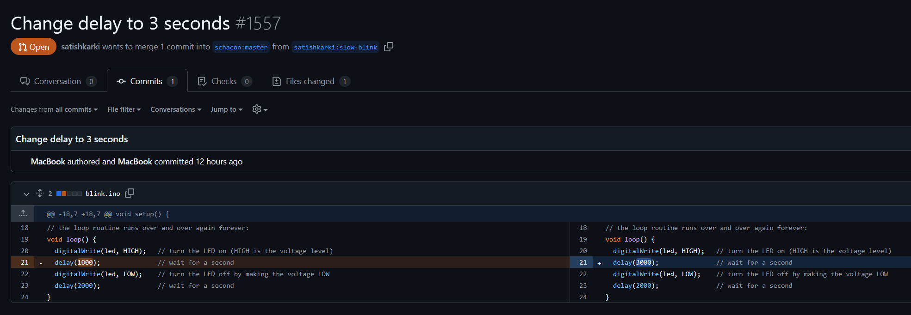
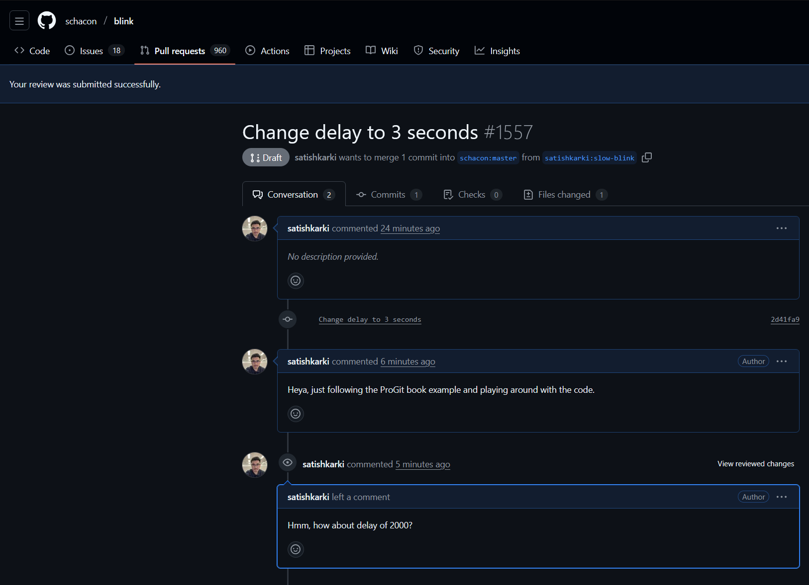
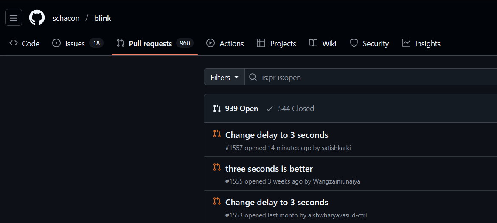

You can check the changes 



And here is how the converation will look like:



If I go to the pull request tab of the project owner, I can see my pull request in the list.




## Advanced Pull Request

```bash
$git remote add upstream https://github.com/schacon/blink
```
is adding a new **remote repository** to your local Git repository.

### What it does, step by step:
1. **`git remote add`**  
   This tells Git to add a new remote (a pointer to another repository) to your local repo.

2. **`upstream`**  
   This is the **name** you are giving to this new remote.  
   - "upstream" is a very common convention for the original repository you forked from.  
   - Your fork (the repo you own) is usually called "origin" by default (when you clone your fork).

3. **`https://github.com/schacon/blink`**  
   This is the **URL** of the remote repository you're linking to — in this case, the original repository (`schacon/blink`) that your fork was created from.

### In plain English:
This command is saying:  
**"Hey Git, please remember this URL (the original repo) and call it 'upstream' from now on."**

### Why people run this command
Most people run this right after **forking a repo** on GitHub.  
Typical workflow:
1. You fork `schacon/blink` → your fork is `your-username/blink`
2. You clone **your fork** to your computer:
   ```bash
   $git clone https://github.com/satishkarki/blink.git
   ```
   → Your local repo has one remote: `origin` (points to your fork)
3. You add the original repo as `upstream`:
   ```bash
   $git remote add upstream https://github.com/schacon/blink
   ```
4. Now you can easily:
   - Pull updates from the original repo: `git fetch upstream` + `git merge upstream/master`
   - Keep your fork in sync with the upstream project.

### How to verify it worked
Run:
```bash
$git remote -v
```

You should see something like:
```bash
$git remote -v

origin  https://github.com/satishkarki/blink.git (fetch)
origin  https://github.com/satishkarki/blink.git (push)
upstream        https://github.com/schacon/blink (fetch)
upstream        https://github.com/schacon/blink (push)
```

That's it! You've now connected your local repo to both your fork (**origin**) and the original project (**upstream**).

